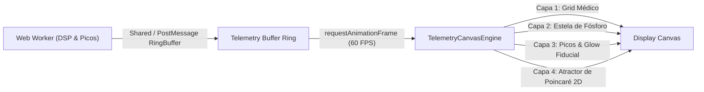

# Arquitectura de Visualización de Telemetría Clínica de Alta Fidelidad

## 1. Principios de Renderizado en Tiempo Real para Señales Fisiológicas

Para lograr una visualización médica de vanguardia con máxima fluidez (60/120 FPS) sin sobrecargar el hilo principal de JavaScript:

---

## 2. Componentes de la Interfaz Médica Avanzada

### A. Trazador de Onda con Persistencia de Fósforo (Osciloscopio Médico)
- **Decay Trail**: La onda se dibuja con un barrido continuo de izquierda a derecha. Las muestras más antiguas sufren una atenuación de alfa exponencial $\alpha(t) = \exp(-\lambda \Delta t)$, emulando las pantallas de tubo de rayos catódicos (CRT) de quirófano y monitores UTI.
- **Gradiente Dinámico**: El color del trazo muta en tiempo real según el **Índice de Calidad de Señal (SQI)** y la **Absorción de Hemoglobina**:
  - Verde Esmeralda Radiante (`#10b981`): Contacto óptimo y perfusión arterial pura.
  - Ámbar Precaución (`#f59e0b`): Contacto inestable o movimiento transitorio.
  - Carmesí Alerta (`#ef4444`): Desconexión o artefacto severo.

### B. Cuadrícula Milimétrica Calibrada
- Escala de tiempo: Marcas principales cada 1 segundo (25 mm/s equivalente clínico).
- Escala de amplitud: Normalización adaptativa con histéresis para evitar saltos bruscos ante cambios posturales.

### C. Espacio de Fases / Diagrama de Poincaré en Vivo
- Proyección 2D instantánea de $(s[n], s[n-\tau])$ en un mini-panel HUD:
  - Pulso normal: Ciclo elíptico cerrado y regular.
  - Extrasístole / Arritmia: Puntos dispersos fuera de la trayectoria principal.
  - Ruido / Objeto inerte: Nube amorfa o punto colapsado en el origen.

### D. Métricas Clínicas de Telemetría
- **BPM Instantáneo y Suavizado** (con indicador de confianza %).
- **Índice de Perfusión (PI %)**: Modulación pulsátil capilar ($AC/DC \times 100$).
- **Índice de Calidad de Señal (SQI %)**: Coherencia espectral y de forma de onda.
- **Frecuencia de Muestreo Real (FPS)** y Jitter de fotogramas en milisegundos.
